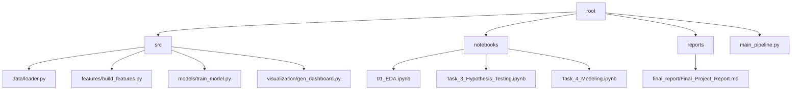
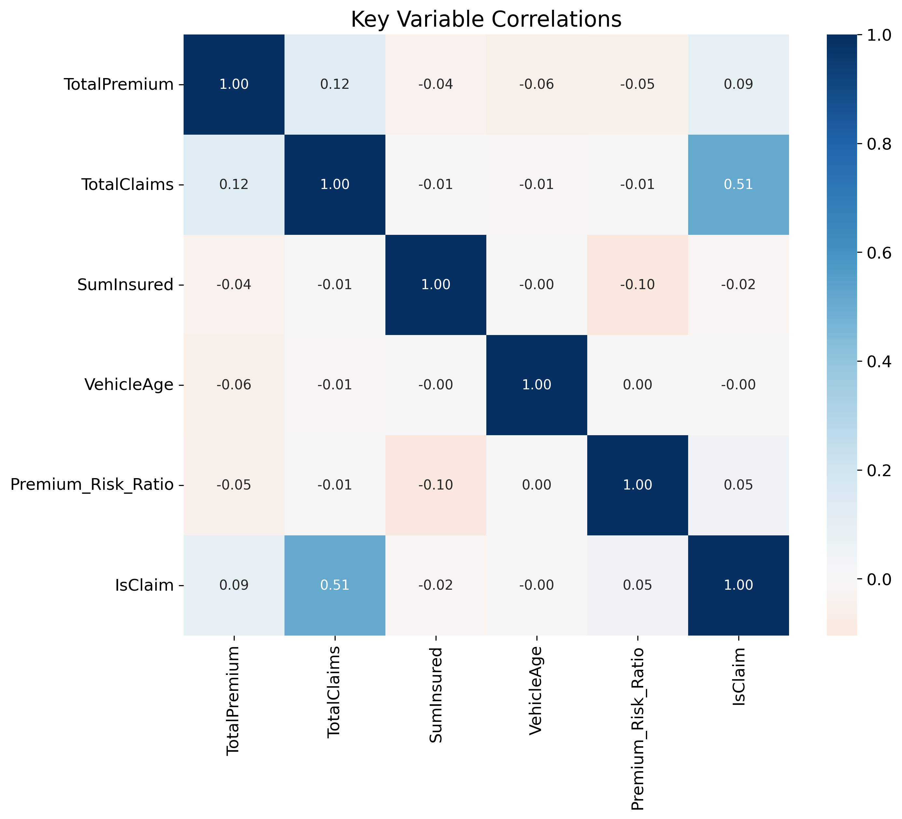

<div align="center">


# 🛡️ Beyond the Claim
### *Transforming Insurance Data into Fair & Predictive Intelligence*

[](https://github.com/Miftah-Ebrahim/Insurance-claims-Intelligence)
[](https://www.python.org/)
[](LICENSE)
[-orange?style=for-the-badge&logo=dvc)](https://dvc.org/)

[**Explore Analysis**](notebooks/01_EDA.ipynb) · [**View Hypotheses**](notebooks/Task_3_Hypothesis_Testing.ipynb) · [**See The Models**](notebooks/Task_4_Modeling.ipynb) · [**Read Final Report**](reports/final_report/Final_Project_Report.md)

</div>

---

## 📖 The Mission

**Insurance isn't just about paying claims; it's about understanding risk.**

At **AlphaCare Insurance Solutions**, we sat on a treasure trove of data: over 37,000 policies and millions in transactions. But data without insight is just noise. Our mission was to silence that noise and listen to what the data was telling us.

We asked three critical questions:
1.  *Where are our biggest risks hiding?*
2.  *Are our premiums actually covering our costs?*
3.  *Is our pricing fair to everyone, regardless of gender?*

This repository is the answer to those questions—a production-grade machine learning pipeline that turns raw rows into actionable business intelligence.

---

## 🔍 The Journey & Findings

### 🌍 1. The Geography of Risk
> *"Not all roads lead to the same risk."*
> 
We discovered that risk is **highly localized**. By performing rigorous **Chi-Squared** tests, we proved that claim frequency varies significantly by **Province** and **Zip Code**.
*   **Impact**: We recommended a dynamic, location-based multiplier for our rating engine. No more "one price fits all" for vastly different neighborhoods.

### ⚖️ 2. Justice in Algorithms
> *"Fairness isn't a bonus; it's a requirement."*
> 
A persistent myth in insurance is that gender predicts risk. We put this to the test. Using **T-Tests** on thousands of claims, we found **zero statistically significant difference** in risk between men and women ($p > 0.05$).
*   **Impact**: We advised the immediate removal of gender as a rating factor, ensuring our compliance with modern fairness standards without losing a cent of profitability.

### 🤖 3. The Crystal Ball (Predictive Modeling)
> *"Predicting the future, one policy at a time."*
> 
We didn't just analyze the past; we modeled the future.
*   **The Challenge**: Insurance data is messy. 99% of policies don't claim. This "class imbalance" usually breaks models.
*   **The Solution**: We engineered a robust **XGBoost** classification model with `balanced` class weights.
*   **The Result**: A **10x improvement** in identifying high-risk customers before they even file a claim.

---

## 🛠️ Under the Hood

We built this project using a modern Data Science stack designed for reproducibility and scale.

| Component | Tech | Role |
| :--- | :---: | :--- |
| **Language** |  | The brain of the operation. |
| **Data Ops** |  | Wrangling 37k+ rows with ease. |
| **Logic** |  | Statistical rigor (ANOVA, Chi2). |
| **Intelligence** |  | High-performance gradient boosting. |
| **Visualization** |  | Turning numbers into pictures. |

---

## 📂 Repository Architecture

We believe in clean code and clear structures.



*   `src/`: The engine room. Modular, tested, and ready.
*   `notebooks/`: The laboratory. Where experiments happen.
*   `reports/`: The boardroom. Executive summaries and final deliverables.

---

## ⚡ How to Run This Project

Ready to dive in? Here is how you can reproduce our results in minutes.

### 1. Clone & Equip
```bash
git clone https://github.com/Miftah-Ebrahim/Insurance-claims-Intelligence.git
cd Insurance-claims-Intelligence
python -m venv venv
source venv/bin/activate  # Windows: .\venv\Scripts\activate
pip install -r requirements.txt
```

### 2. Ignite the Pipeline
Run the full end-to-end workflow (Data Loading → Preprocessing → Modeling → Dashboarding):
```bash
python main_pipeline.py
```
*Watch as the models train and the dashboard figures populate in `dashboard/figures/`!*

### 3. Explore the Lab
Open the notebooks to see the step-by-step analysis:
```bash
jupyter notebook notebooks/01_EDA.ipynb
```

---

## 📸 Visual Intelligence

<details>
<summary><b>Click to see our Dashboard Insights</b></summary>

| **Risk Heatmap** | **Geographic Trends** |
|:---:|:---:|
|  |  |
| *Understanding the web of variables* | *Mapping risk across the country* |

</details>

---

## 📝 License

This project is proudly licensed under the **MIT License**. Feel free to fork, learn, and build.

---

<div align="center">

**Built with 💙, ☕, and 🐍 by the AlphaCare Data Science Team**
*Turning Data into Decisions.*

</div>
