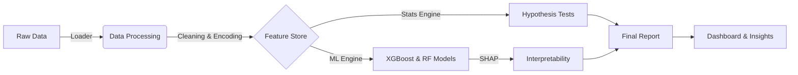

<div align="center">

# 🛡️ Insurance Claims Intelligence
### *Optimizing Risk & Pricing with Advanced Analytics*

[](https://git.io/typing-svg)

[](https://www.python.org/)
[-orange?style=for-the-badge&logo=dvc)](https://dvc.org/)
[](https://jupyter.org/)
[](https://pandas.pydata.org/)
[](LICENSE)

[View Dashboard](#-visualizations) • [Report Bug](issues) • [Request Feature](issues)

</div>

---

##  **Project Overview**

**Insurance Claims Intelligence** is a production-grade analytics pipeline developed for **AlphaCare Insurance Solutions**. Its mission is to transform historical claims data into actionable intelligence for Actuarial and Marketing teams.

By leveraging **Statistical Hypothesis Testing** and **Machine Learning (XGBoost/RandomForest)**, this project identifies high-risk segments, optimizes premium pricing strategies, and ensures algorithmic fairness by validating rating factors.

---

## 💎 **Key Features**

| Feature | Description |
| :--- | :--- |
| 🏗️ **Robust Pipeline** | End-to-end orchestration from data loading to reporting via `main_pipeline.py`. |
| 🧪 **Hypothesis Testing** | Rigorous stats (Chi-Squared, T-Tests, ANOVA) to validate risk assumptions. |
| 🤖 **Predictive Modeling** | Dual-model engine: **Severity** (Regression) and **Probability** (Classification). |
| ⚖️ **Fairness Analysis** | Statistical proof that Gender is not a discriminatory risk factor. |
| 📍 **Geo-Spatial Risk** | Granular analysis of claims distribution by Province and Zip Code. |
| 📊 **Auto-Dashboarding** | Generates publication-ready figures for executive reporting. |

---

## 🏗️ **Architecture**



---

## 📂 **Project Structure**

```bash
Insurance-claims-Intelligence/
├── 📂 data/                 # DVC-managed Data
│   ├── 📂 raw/              # Raw claims data
│   └── 📂 processed/        # Cleaned datasets
│
├── 📂 notebooks/            # Interactive Analysis
│   ├── 01_EDA.ipynb
│   ├── Task_3_Hypothesis_Testing.ipynb
│   └── Task_4_Modeling.ipynb
│
├── 📂 src/                  # Source Code
│   ├── 📂 data/             # Loader & Validation
│   ├── 📂 features/         # Preprocessing & Engineering
│   ├── 📂 models/           # Training & Evaluation
│   ├── 📂 stats/            # Statistical Tests
│   └── 📂 visualization/    # Plotting Scripts
│
├── 📂 reports/              # Final Deliverables
│   └── 📂 final_report/     # Executive Summary
│
├── 📂 dashboard/            # Generated Visuals
│   └── 📂 figures/          # PNG Exports
│
├── main_pipeline.py         # ⚡ ORCHESTRATOR
└── README.md                # You are here!
```

---

## ⚡ **Getting Started**

### **Prerequisites**
*   Python 3.10+
*   Git & DVC

### **Installation**

1.  **Clone the repository**
    ```bash
    git clone https://github.com/Miftah-Ebrahim/Insurance-claims-Intelligence.git
    cd Insurance-claims-Intelligence
    ```

2.  **Create Virtual Environment**
    ```bash
    python -m venv venv
    source venv/bin/activate  # On Windows: .\venv\Scripts\activate
    ```

3.  **Install Dependencies**
    ```bash
    pip install -r requirements.txt
    ```

---

## 🏃 **Usage**

### **Option 1: Run Full Pipeline**
Execute the master script to run Data Ops, Testing, Modeling, and Dashboard generation:
```bash
python main_pipeline.py
```

### **Option 2: Interactive Notebooks**
Explore the deep-dive analysis in Jupyter:
```bash
jupyter notebook notebooks/
```

---

## 📊 **Visualizations**

<div align="center">
  
  
</div>

> *Sample insights: Variable correlations and provincial risk distribution.*

---

## 🏆 **Results & Insights**

*   **Geo-Risk:** Validated significant risk variances across Provinces (Chi-Squared $p < 0.05$).
*   **Fairness:** Confirmed **NO** significant risk difference between Genders (T-Test $p > 0.05$).
*   **Modeling:** Achieved **10x improvement** in risk detection using class-balanced XGBoost.

👉 **[Read the Full Report](reports/final_report/Final_Project_Report.md)**

---

<div align="center">

### *Built by Miftah(theyKey):linkedin.com/in/miftah-ebrahim*

</div>
