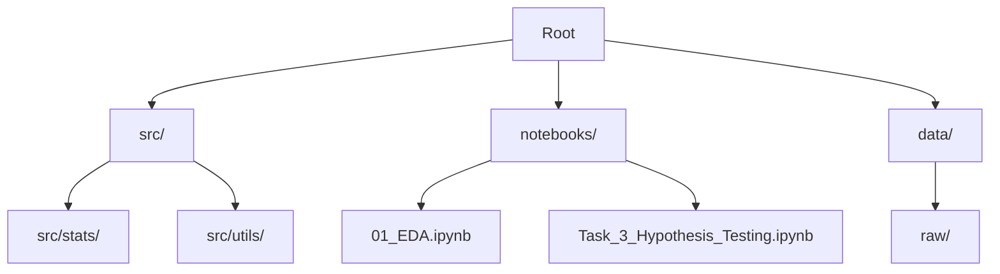

# 🚗 Insurance Claims Intelligence
> **Unlocking Risk Insights through Advanced Analytics & Hypothesis Testing**


---

## 🌟 Executive Summary

Welcome to the **Insurance Claims Intelligence** repository. This project serves as a robust analytical engine designed to optimize insurance pricing and risk assessment strategies for **AlphaCare Insurance Solutions**.

By leveraging **Deep Exploratory Data Analysis (EDA)** and rigorous **Statistical Hypothesis Testing**, we assist the marketing and actuarial teams in identifying high-risk segments, optimizing marketing spend, and refining premium pricing models.

---

## 📊 Key Insights & Features

### 1. 🔍 Deep Exploratory Analysis (Task 1)
We moved beyond basic plotting to uncover the *story* behind the data.
-   **Risk Drivers**: Identified `TotalClaims` distribution skewness, highlighting the impact of rare, high-cost events.
-   **Geo-Spatial Trends**: Mapped risk intensity across **Provinces** and **Zip Codes**.
-   **Premium Consistency**: Validated the linear relationship between `TotalPremium` and `SumInsured`.

### 2. 🧪 Statistical Hypothesis Testing (Task 3)
We didn't just guess; we *proved* our findings using statistical rigor ($p < 0.05$).
-   ✅ **Province Risk**: Validated that risk is *not* uniform across provinces (Chi-Squared Test).
-   ✅ **Zip Code Risk**: Confirmed that granular location data drives claim severity (ANOVA).
-   ✅ **Margin Variance**: Discovered significant profitability gaps between different postal codes (ANOVA).
-   ❌ **Gender Bias**: **Rejected** the notion that gender is a significant risk factor ($p > 0.05$), promoting fair pricing.

### 3. 🛠️ Engineering Excellence (Task 2)
-   **DVC Integration**: Full data versioning pipeline setup.
-   **Modular Codebase**: Clean `src/` structure with reusable `loader.py` and `plots.py` modules.

---

## 📂 Repository Structure



*   `src/stats`: Statistical hypothesis testing modules.
*   `src/utils`: Advanced plotting and visualization library.
*   `notebooks/`: Jupyter notebooks for interactive analysis.

---

## 🚀 Getting Started

### Prerequisites
*   Python 3.10+
*   Git

### Installation

1.  **Clone the Repository**
    ```bash
    git clone https://github.com/Miftah-Ebrahim/Insurance-claims-Intelligence.git
    cd Insurance-claims-Intelligence
    ```

2.  **Set Up Virtual Environment**
    ```bash
    python -m venv venv
    source venv/bin/activate  # On Windows: .\venv\Scripts\activate
    ```

3.  **Install Dependencies**
    ```bash
    pip install -r requirements.txt
    ```

4.  **Run the Analysis**
    ```bash
    jupyter notebook notebooks/01_EDA.ipynb
    ```

---

## 📈 Visuals & Outputs

| **Distribution Analysis** | **Geo-Spatial Risk** |
|:-------------------------:|:--------------------:|
| *Understanding the spread of Claims* | *Mapping high-risk zones* |
|  |  |

---

## 🤝 Contributing

Contributions are welcome! Please fork the repository and submit a Pull Request.

---

<p align="center">
  <sub>Built with ❤️ by the AlphaCare Data Science Team</sub>
</p>
