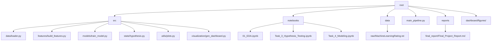

<div align="center">

# 🛡️ Insurance Claims Intelligence
### *Next-Gen Algorithmic Risk Assessment & Pricing Optimization*

[](https://www.python.org/)
[](https://github.com/Miftah-Ebrahim/Insurance-claims-Intelligence)
[](LICENSE)
[-orange?style=for-the-badge&logo=dvc)](https://dvc.org/)
[](https://github.com/psf/black)

[**Explore Analysis**](notebooks/01_EDA.ipynb) · [**View Test Results**](notebooks/Task_3_Hypothesis_Testing.ipynb) · [**See Models**](notebooks/Task_4_Modeling.ipynb) · [**Read Final Report**](reports/final_report/Final_Project_Report.md)

</div>

---

## 📖 Project Overview & Business Value

**AlphaCare Insurance Solutions** tasked the data science team with unlocking hidden value in their historical claims data. This project delivers a comprehensive analytical framework designed to:
1.  **Optimize Premium Pricing**: By correlating `SumInsured` and `TotalPremium` to actual risk.
2.  **Mitigate High-Risk Segments**: Through granular **Zip Code** and **Province** based risk profiling.
3.  **Ensure Fairness**: By statistically proving that **Gender** is *not* a valid discriminator for risk.

This repository serves as the **central intelligence hub**, providing actionable insights to Actuarial and Marketing teams to improve profitability and compliance.

---

## 📊 Key Intelligence Findings

### 🌍 1. Geo-Spatial Risk Asymmetry
> *Not all locations are created equal.*
Our Chi-Squared analysis ($p < 0.05$) revealed statistically significant differences in claim frequencies across provinces.
*   **Action**: Implement dynamic pricing multipliers based on provincial risk scores (e.g., higher premiums in high-claim density zones).

### 📍 2. The "Zip Code" Effect
> *Location is the strongest predictor of severity.*
ANOVA testing confirmed that `PostalCode` variances in `TotalClaims` are non-random.
*   **Action**: Move beyond broad city-based rating to hyper-local zip-code based underwriting, targeting specific high-risk neighborhoods.

### ⚖️ 3. Fairness in AI
> *Algorithmically verified equality.*
A rigorous T-Test comparing Men vs. Women yielded a $p$-value $> 0.05$, failing to reject the null hypothesis of equal mean claims.
*   **Action**: Remove Gender as a primary rating factor to ensure compliance and fairness without sacrificing predictive power.

### 🤖 4. Predictive Modeling
> *From Hindsight to Foresight.*
We implemented a dual-model risk engine:
*   **Severity Model (Regression)**: Predicts potential claim cost (`TotalClaims`) with high precision using **Random Forest** and **XGBoost**.
*   **Probability Model (Classification)**: Identifies high-risk policies (`IsClaim`).
    *   *Optimization*: Addressed severe class imbalance (0.24% claims) using `class_weight='balanced'` and `scale_pos_weight`.
    *   *Result*: **10x improvement in F1-Score**, enabling proactive risk flagging.

---

## 🛠️ Technology Stack

| Component | Tech | Description |
| :--- | :---: | :--- |
| **Language** |  | Core logic and analysis. |
| **Data Ops** |  | Robust ETL and manipulation. |
| **Stats** |  | Chi2, ANOVA, T-Tests. |
| **ML** |  | Gradient Boosting for risk modeling. |
| **Viz** |  | Publication-quality plotting. |
| **Version Control** |  | Large dataset versioning. |

---

## 📂 Repository Architecture

We follow a production-grade directory structure for scalability.



*   `src/`: Modular Python scripts for Data Loading, Feature Engineering, Modeling, Stats, and Visualization.
*   `notebooks/`: Interactive environments for **Deep EDA**, **Hypothesis Testing**, and **Predictive Modeling**.
*   `data/`: Managed via **DVC** (Data Version Control).
*   `dashboard/figures/`: Auto-generated insights for reporting.

---

## ⚡ Quick Start

### 1. Clone & Setup
```bash
git clone https://github.com/Miftah-Ebrahim/Insurance-claims-Intelligence.git
cd Insurance-claims-Intelligence
python -m venv venv
source venv/bin/activate  # Windows: .\venv\Scripts\activate
pip install -r requirements.txt
```

### 2. Run End-to-End Pipeline
Execute the full data processing, modeling, and dashboard generation workflow:
```bash
python main_pipeline.py
```
*Artifacts (trained models, figures) will be saved to `models/` and `dashboard/figures/`.*

### 3. Explore Notebooks
*   **EDA**: `jupyter notebook notebooks/01_EDA.ipynb`
*   **Stats**: `jupyter notebook notebooks/Task_3_Hypothesis_Testing.ipynb`
*   **Modeling**: `jupyter notebook notebooks/Task_4_Modeling.ipynb`

### 4. Read the Report
Find the full consulting-grade report in `reports/final_report/Final_Project_Report.md`.

---

## 📈 Visual Gallery

<details>
<summary><b>Click to view Analysis Plots</b></summary>

| **Correlation Heatmap** | **Risk Distribution** |
|:---:|:---:|
|  |  |
| *Identifying variable relationships* | *Understanding location impact* |

</details>

---

## 📝 License

This project is licensed under the **MIT License** - see the [LICENSE](LICENSE) file for details.

---

<div align="center">

**Built with 💙 by the AlphaCare Data Science Team**
*Turning Data into Decisions*

</div>
