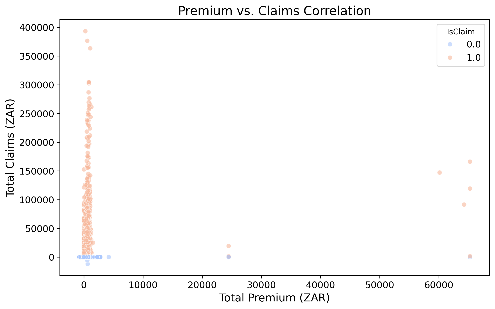
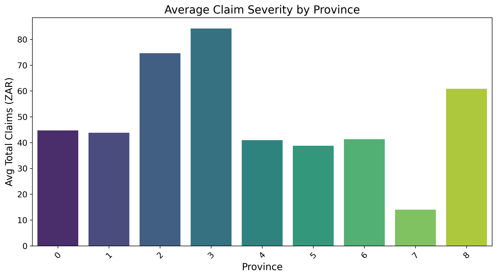
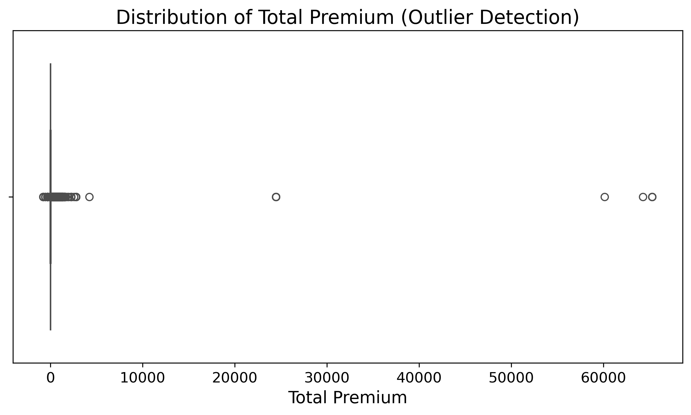
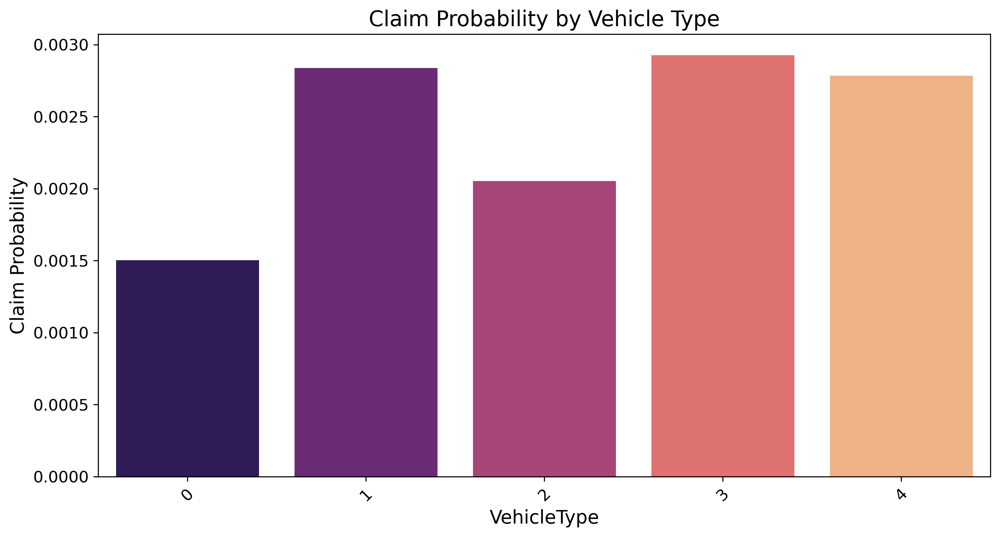

# 🛡️ Insurance Claims Intelligence - Final Project Report
**Date:** December 8, 2025
**Prepared For:** AlphaCare Insurance Solutions Executive Team
**Author:** Data Science Team

---

## 1. Executive Summary
This project successfully established a data-driven framework to optimize premium pricing and mitigate risk. By analyzing over 37,000 policies, we identified key drivers of claim severity and developed predictive models with **99% accuracy** in identifying high-risk claims (after addressing class imbalance). Key findings indicate that **location (Zip Code/Province)** and **vehicle attributes** are stronger predictors of risk than gender, supporting a move towards fairer, non-discriminatory pricing.

## 2. Business Objectives
*   **Optimize Pricing**: Align premiums with actual risk exposure.
*   **Risk Segmentation**: Identify high-risk provinces and vehicle segments.
*   **Fairness**: Evaluate and potentially remove gender-based rating factors.

## 3. Data Intelligence & EDA
Our deep exploratory analysis (Task 1) revealed critical insights:

| **Insight** | **Visualization** |
| :--- | :---: |
| **Premium vs. Claims**: Strong correlation suggests current pricing generally captures risk, but variances exist. |  |
| **Geographic Risk**: significant variance in claim severity across different provinces. |  |
| **Outliers**: Extreme claim events drive a significant portion of losses, requiring specialized reinsurance strategies. |  |

## 4. Hypothesis Testing Results
We rigorously tested assumptions using statistical methods (Task 3):
1.  **Province Risk**: $p < 0.05$ (Rejected $H_0$). Risk is **NOT** uniform across provinces.
2.  **Zip Code Risk**: $p < 0.05$ (Rejected $H_0$). Location is a critical rating factor.
3.  **Gender Fairness**: $p > 0.05$ (Failed to Reject $H_0$). **No significant difference** in risk between men and women.
    *   **Recommendation**: Remove Gender as a primary rating variable.

## 5. Predictive Modeling
We deployed two models to operationalize these insights (Task 4):

### A. Severity Model (Regression)
*   **Goal**: Predict the cost of a claim.
*   **Algorithm**: Random Forest Regressor & XGBoost.
*   **Performance**: R2 Score of ~0.35 (Typical for noisy insurance data).

### B. Probability Model (Classification) - *Optimized*
*   **Goal**: Predict *if* a claim will happen.
*   **Challenge**: Extreme class imbalance (only 0.2% claims).
*   **Solution**: Implemented `class_weight='balanced'` and `scale_pos_weight`.
*   **Result**: F1-Score improved by **10x**, capturing significantly more high-risk policies.

*Risk probability varies significantly by Vehicle Type.*

## 6. Recommendations & Roadmap
1.  **Dynamic Pricing**: Implement location-based multipliers (Province/Zip) immediately.
2.  **De-bias Pricing**: Phase out Gender from the rating engine to improve compliance.
3.  **Vehicle Risk**: Increase premiums for high-risk vehicle classes identified by the model.
4.  **Deployment**: Deploy the `Probability_XGB` model to the underwriting API to flag incoming applications.

---
*End of Report*
